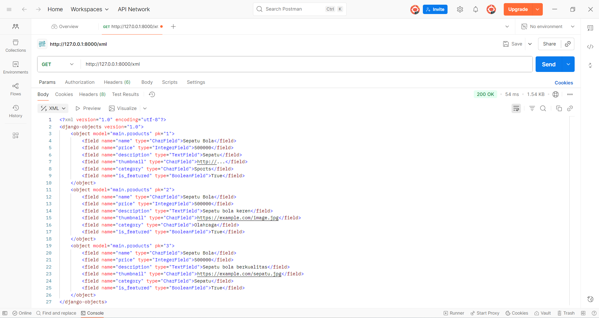
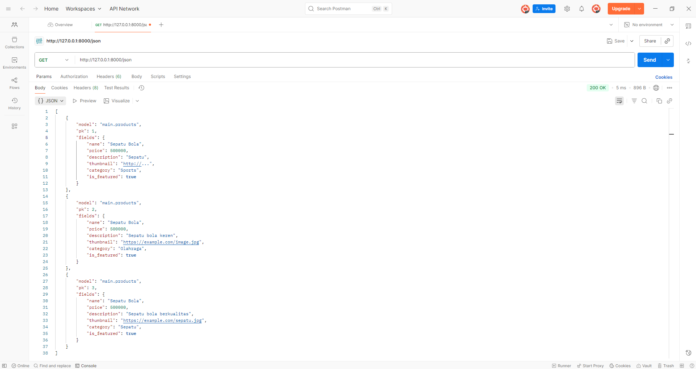

# eshop-pbp

## Tautan Deploy PWS
Aplikasi sudah di-deploy di PWS, dapat diakses melalui:  
[https://johannes-nichola-eshoppbp.pbp.cs.ui.ac.id/]

---

## TUGAS 2
## Implementasi Checklist Step-by-Step

1. **Step-by-step membuat proyek Django baru**
    1. Buat proyek Django baru dengan code django-admin startproject eshop_pbp lalu masuk ke folder project.
    2. Buat aplikasi main dengan code python manage.py startapp main.
    3. Atur routing di eshop_pbp/urls.py dengan menambahkan path("", include("main.urls")).
    4. Buat model Product (class) pada main models.py sesuai atribut yang telah ditentukan.
    5. Migrasi database dengan code python manage.py makemigrations kemudian python manage.py migrate.
    6. Buat fungsi view (def show_main(request)) pada main/views.py yang akan melakukan render template main.html dengan data Product.
    7. Routing aplikasi dengan mengarahkan path ke fungsi view di main/urls.py.
    8. Buat template pada main.html untuk menampilkan data Product dengan sintaks .
    9. Finishing, push ke repo, dan jalankan deploy melalui PWS.

2. **Bagan request client ke web aplikasi berbasis Django** 
    Client (Browser)
        |
        | HTTP Request ((GET /) atau (/products))
        v
    urls.py (Routing)
        |
        | Pemetaan URL ke fungsi/view tertentu
        v
    views.py (Logic)
        |
        | Ambil data dari models.py (database) jika perlu
        v
    models.py (Database)
        |
        | Query/Manipulasi data
        v
    views.py
        |
        | Kirim data ke template
        v
    Template HTML (main.html)
        |
        | Render data menjadi HTML
        v
    Client (Browser)
        |
        | HTTP Response (HTML page)

3. **Peran settings.py dalam proyek Django**
    settings.py digunakan untuk mengontrol seluruh perilaku *project* mulai dari konfigurasi dasar (SECRET_KEY, DEBUG, ALLOWED_HOSTS), database (DATABASES), aplikasi yang aktif (INSTALLED_APPS), template (TEMPLATES), keamanan, hingga deployment. Tanpa adanya settings.py, Django tidak mengerti bagaimana cara menjalankan *project* yang dibuat.

4. **Cara kerja migrasi database di Django**
    Migrasi database di Django dilakukan dengan cara Django menerjemahkan model Python menjadi tabel di database. Proses dimulai ketika kita menuliskan model di models.py berisi field dan tipe datanya. Kemudian, Django membuat file migrasi (python manage.py makemigrations). Selanjutnya, Django membaca file migrasi dan menjalankan SQL agar sesuai tabel database (python manage.py migrate). Terakhir, setiap migrasi akan dicatat agar tidak berulang.

5. **Alasan Django dijadikan permulaan pembelajaran pengembangan perangkat lunak**
    Django merupakan full-stack framework yang sudah menyediakan semua komponen utama web (routing, model/database, views, template, admin), sehingga pemula bisa fokus memahami arsitektur MVT tanpa harus menggabungkan banyak tools. Struktur proyeknya jelas, interaksi database yang mudah, dan dokumentasinya lengkap, membuat Django ideal sebagai langkah pertama belajar pengembangan perangkat lunak.

6. **Feedback untuk asisten dosen**
    Bagi saya, apa yang disampaikan dan dijelaskan asisten dosen sudah cukup baik. Ketika ada pertanyaan pun asisten dosen dapat dengan baik menjelaskan dan asisten dosen juga tidak asal menjawab jika belum mengerti. Saya rasa, performa asisten dosen sudah cukup baik.

## TUGAS 3
## Implementasi Checklist Step-by-Step

1. **Data Delivery diperlukan dalam Pengimplementasian Sebuah Platfom**
    Data delivery diperlukan agar data dari server dapat dikirim ke client (misal browser atau aplikasi mobile) dengan cara yang terstruktur dan mudah diolah. Tanpa data delivery yang baik, platform tidak bisa menampilkan informasi secara real-time, konsisten, atau aman. Data delivery juga memungkinkan integrasi antar sistem dan mendukung API, sehingga data bisa digunakan di berbagai front-end atau layanan lain.

2. **XML dan JSON: JSON Lebih Populer**
    Menurut saya, JSON lebih baik dari XML, dan tentu JSON lebih populer bukan tanpa alasan. Terdapat beberapa hal yang membuat JSON lebih populer, diantaranya JSON lebih ringan (ukurannya lebih kecil dan lebih cepat dikirim dibandingkan dengan XML). Selain itu, syntax yang lebih sederhana menjadi alasan utama bagi saya mengapa JSON lebih populer (JSON lebih mudah dibaca manusia dan bisa langsung digunakan di JS). JSON pun didukung hampir semua bahasa pemrograman modern (high level).

3. **Fungsi method is_valid() pada form Django**
    is_valid() adalah method untuk memeriksa apakah data yang dikirim oleh user memenuhi aturan validasi form (return boolean). Validasi ini diperlukan agar data yang akan tersimpan di database valid dan aman. Selain itu, dapat membantu user dengan memberi feedback error jika ada data yang salah/tidak lengkap.

4. **Pentingnya csrf_token dalam membuat form di Django**
    csrf_token digunakan untuk melindungi aplikasi dari serangan CSRF (Cross-Site Request Forgery). Artinya, dengan csrf_token, server dapat memverifikasi request yang masuk ke aplikasi kita berasal dari situs resmi, sehingga penyerang (user tidak bertanggung jawab) tidak dapat memanipulasi data/aksi tidak sah (membuat form palsu di situs lain dan request tanpa sepengetahuan user asli (user yang benar benar ingin menggunakan aplikasi kita)).

5. **Step-by-step melanjutkan proyek Django**
    1. Melanjutkan proyek Django (eshop-pbp) yang sudah dibuat sebelumnya.
    2. Menambahkan fungsi create_products() dan show_products() untuk membuat produk baru dan menampilkan detail produk, kemudian tambahkan path URL dalam variabel urlpatterns pada file urls.py.
    3. Membuat halaman (main.html) yang menampilkan data objek dengan tombol "+ Add Products" yang redirect ke halaman form (create_products.html) dan tombol "Detail" di setiap produk untuk menampilkan detail produk (products_detail.html).
    4. Membuat halaman form untuk menambahkan objek model pada app sebelumnya (models.py -> forms.py -> views.py -> create_products.html). File models.py untuk bagan data, forms.py untuk data apa yang akan dimintai input dari user, views.py menghubungkan data amodels.py untuk ditampilkan melalui create_products.html.
    5. Membuat halaman yang menampilkan detail dari setiap data objek model (models.py -> views.py -> products_detail.html). File models.py untuk bagan data, views.py menghubungkan data pada database berbentuk models.py untuk ditampilkan melalui products_detail.html.
    6. Menambahkan 4 fungsi views (show_xml(), show_json(), show_xml_by_id(), show_json_by_id()) sebagai method untuk menampilkan data dari models.py. Tidak lupa untuk menambahkan path URL ke dalam variabel urlpatterns keempat fungsi tersebut yang telah diimport dari views.py ke urls.py
    7. Gunakan Postman sebagai Data Viewer

6. **Feedback untuk asisten dosen**
    Bagi saya, apa yang disampaikan dan dijelaskan asisten dosen sudah cukup baik. Ketika ada pertanyaan pun asisten dosen dapat dengan baik menjelaskan dan asisten dosen juga tidak asal menjawab jika belum mengerti. Saya rasa, performa asisten dosen sudah cukup baik.

## Screenshot hasil akses URL pada Postman

## TUGAS 4
## Implementasi Checklist Step-by-Step

1. **Apa itu AuthenticationForm?**
    AuthenticationForm pada Django adalah form bawaan Django yang digunakan untuk proses login dengan melakukan validasi melalui pemeriksaan username dan password terhadap autentikasi. Kelebihannya, karena merupakan form bawaan, AuthenticationForm ini siap pakai tanpa menulis ulang logicnya, terintegrasi dengan autentikasi Django, dan tentunya aman. Namun, AuthenticationForm kurang fleksibel. JIka ingin custom layoutnya, diperlukan override. Selain itu, perlu memanggil request jika diperlukan.

2. **Perbedaan autentikasi dan otorisasi, serta cara Django mengimplementasikannya**

    Autentikasi artinya sistem memastikan identitas pengguna seperti login yang akan memastikan username dan password pengguna. Di sisi lain, otorisasi artinya sistem menentukan apa saja yang bisa dilakukan (function apa saja yang bisa digunakan) oleh pengguna. Django mengimplementasikan kedua hal tersebut dengan syntax berbeda. Untuk autentikasi contohnya import authenticate, login, logout dari django.contrib.auth. Sedangkan untuk otorisasi meski belum dipelajari, contoh sederhananya saja dengan menambahkan function permission() dan sejenisnya yang akan menentukan apa saja function yang dapat dijalankan pada akun pengguna.

3. **Kelebihan dan Kekurangan Session dan Cookies dalam menyimpan state** 
    Session :
        Karena server yang menyimpan data session dan browser hanya menyimpan session id, maka data jadi lebih aman karena data sensitif tidak ada di browser, namun jadi diperlukan storage server.
    Cookies :
        Karena state disimpan di browser dan dikirim ke server setiap request, maka prosesnya menjadi lebih mudan dan cepat karena dilakukan tanpa storage server, namun jadi rentan terhadap pemindahtanganan dan manipulasi jika tidak Secure dan tanpa enkripsi.

4. **Apakah penggunaan cookies aman secara default? Risiko & bagaimana Django menanganinya**
    Penggunaan cookies secara default tidak otomatis aman. Cookies default dapat diread/write oleh klien kecuali diatur flags. Contoh risikonya adalah CSRF yaitu aksi yang dilakukan tanpa izin. Django dapat menangani/memitigasinya dengan penambahan middleware CSRF, dalam project ini contohnya ada di settings.py dengan code 'django.middleware.csrf.CsrfViewMiddleware' yang secara langsung mengaktifkan proteksi CSRF di Django.

5. **Step-by-step melanjutkan proyek Django**
    1. Menambahkan fitur register, login, dan logout, dengan cara membuat fungsinya (register(request), login_user(request), dan logout_user(request)) di views.py. Kemudian, tambahkan html register.html, dan login.html, serta tombol logout di main.html. Tambahkan juga path ketiganya di urls.py.
    2. Membatasi akses dengan login_required dengan import decorator (@login_required) dan menambahkan decoratornya di atas fungsi show_main dan show_products.
    3. Menyimpan dan menampilkan data last_login menggunakan cookies dengan import datetime, HttpResponseRedirect dan reverse. Kemudian, ketika login berhasil, maka cookie akan ditambahkan dengan last_login adalah waktu saat terakhir kali login. Ketika logout, cookie akan dihapus dengan code response.delete_cookie('last_login')
    4. Menghubungkan model dengan user dengan import User di models.py dan menambahkan field user di model (user = models.ForeignKey(User, on_delete=models.CASCADE, null=True)). Kemudian, dilakukan beberapa modifikasi code untuk fungsi create_products dan filter produk berdasarkan user di show_main beserta tombol filternya di main.html.
    5. Terakhir, menampilkan Author di halaman detail dengan penambahan code di products_detail.html.

## TUGAS 5
## Implementasi Checklist Step-by-Step

1. **Urutan Prioritas Pengambilan CSS Selector dari yang Tertinggi**
    1. Inline Style
        - langsung ditulis di tag HTML
    2. ID Selctor (#id)
        - hanya menargetkan elemen dengan atribut id tertentu (#iniTarget{...})
    3. Pseudo-class Selector (:hover, dll)
        - menargetkan elemen yang sedang dalam keadaan tertentu (button:hover {...} -> button saat kursar berada di atas button)
    4. Attribute Selector ([attribute="value"])
        - menargetkan elemen yang memiliki atribut tertentu (input[type="text"]{...})
    5. Class Selector (.class)
        - menargetkan elemen yang memiliki atribut class (.card-style {...})
    6. Type Selector
        - menargetkan elemen HTML tertentu (h1 {...})
    7. Universal Selector (*)
        - menargetkan semua elemen di halaman (* {...})

2. **Pentingnya Responsive Design dan Contoh Aplikasinya**
    Responsive Design sangat penting dan diperlukan karena konsep ini memastikan tampilan aplikasi menyesuaikan ukuran layar baik desktop maupun mobile, sehingga pengguna dapat menggunakan aplikasi dengan nyaman melalui perangkat apapun. Tanpa adanya responsive design, layout aplikasi akan rusak/tidak nyaman untuk dilihat saat ukuran/device yang digunakan berbeda. Sebagai contoh, aplikasi dari proyek ini awalnya tidak menggunakan responsive design, sehingga elemen yang tadinya terlihat rapi di web, menjadi tumpang tindih saat dibuka melalui perangkat mobile. Namun, ketika sudah menggunakan responsive design, meskipun ada perbedaan tampilan antara web dengan mobile, perbedaan itulah yang membuat layout sesuai dengan perangkat maupun ukuran. Dalam konteks ini, pada ukuran tertentu/perangkat mobile, elemen pada navbar dimasukkan ke dalam icon hamburger (menu).

3. **Perbedaan Antara Margin, Border, dan Padding, serta Cara Pengimplementasiannya**
    1. Margin  : ruang di luar elemen yang memisahkan elemen satu dengan yang lain.
    2. Border  : garis di tepi elemen yang membungkus konten dan padding.
    3. Padding : ruang di dalam elemen yang memisahkan atara konten dengan border.
    Cara Implementasi : (contoh)
        div {
            margin  : 20px;
            border  : 5px solid black;
            padding : 10px;
        }

4. **Flex Box dan Grid Layout**
    1. Flex Box
        - Sistem pengaturan tata letak (layout) satu dimensi yang digunakan untuk meyusun elemen secara fleksibel dalam satu baris atau kolom sehingga memudahkan perancangan struktur layout responsif yang fleksibel. 
        - Biasa digunakan untuk membuat navbar, tombol, dan card list

    2. Grid Layout
        - Sistem pengaturan tata letak (layout) dua dimensi yang digunakan untuk mengatur layout elemen sehingga dapat diposisikan ke dalam baris dan kolom secara bersamaan. Tentu memudahkan dalam perancangan desain aplikasi yang kompleks dan responsif.
        - Biasa digunakan untuk membuat semacam gallery, dashboard, atau dalam proyek ini product grid

5. **Step-by-step melanjutkan proyek Django**
    1. Menambahkan Tailwind ke Aplikasi
    2. Menambahkan fitur Edit Products dengan menambahkan fungsi edit_products pada views.py, membuat file HTML edit_products.html, menambahkan path url dalam urlpatterns urls.py, dan menambahkan kode pada main.html untuk menampilkan fitur Edit Products.
    3. Menambahkan fitur Delete Products dengan menambahkan fungsi delete_products pada views.py, menambahkan path url dalam urlpatterns urls.py, dan menambahkan kode pada main.html untuk menampilkan fitur Delete Products.
    4. Menambahkan Navigation Bar pada Aplikasi.
    5. Menambahkan global.CSS untuk styling Aplikasi dengan Tailwind, menghubungkannya ke base.html.
    6. Styling navbar, halaman login, halaman register, halaman home, halaman detail products, halaman create products, dan halaman edit products menjadi unik, menarik, dan responsive.
    7. Halaman detail produk akan menampilkan gambar dan pesan bahwa belum ada product yang terdaftar jika belum ada produk, dan jika sudah ada, akan menampilkan detail setiap product dengan menggunakan card.
    8. Card Product sudah mengandung dua button, 1 untuk edit product dan 1 untuk delete product.
    9. Mengubah navbar agar menjadi responsive terhadap perbedaan ukuran device terutama mobile dan desktop.

## TUGAS 6

1. **Perbedaan antara synchronous request dan asynchronous request**
Synchronous request adalah permintaan yang dijalankan secara berurutan — browser akan menunggu server menyelesaikan permintaan dan mengirimkan respons sebelum pengguna bisa berinteraksi lagi dengan halaman. Sedangkan asynchronous request (seperti yang dilakukan dengan AJAX) berjalan di belakang layar tanpa harus me-reload halaman, sehingga pengguna tetap bisa berinteraksi dengan website sambil data sedang diproses.

2. **Bagaimana AJAX bekerja di Django (alur request–response)**
AJAX bekerja dengan cara mengirimkan permintaan ke URL Django (biasanya view yang didekorasi dengan @csrf_exempt dan @require_POST) menggunakan JavaScript, tanpa perlu memuat ulang halaman. Django kemudian memproses data tersebut di server, membuat respons (biasanya dalam format JSON), dan mengirimkannya kembali ke browser. JavaScript lalu menangani hasil respons tersebut untuk memperbarui tampilan halaman secara dinamis, misalnya menambahkan produk baru ke daftar tanpa reload.

3. **Keuntungan menggunakan AJAX dibandingkan render biasa di Django**
Keuntungan utama AJAX adalah pengalaman pengguna yang lebih cepat dan interaktif. Karena AJAX tidak perlu me-reload seluruh halaman, hanya data tertentu saja yang diambil atau diubah, sehingga penggunaan bandwidth lebih efisien dan tampilan terasa lebih responsif. Selain itu, AJAX membuat aplikasi terasa seperti “real-time”, misalnya saat menambah produk langsung muncul di daftar tanpa harus berpindah halaman.

4. **Cara memastikan keamanan saat menggunakan AJAX untuk fitur Login dan Register di Django**
Untuk menjaga keamanan saat menggunakan AJAX pada login dan register, penting untuk tetap menggunakan token CSRF yang disediakan Django agar permintaan hanya bisa datang dari situs yang sah. Selain itu, data yang dikirim dari client perlu divalidasi di server menggunakan form Django, dan setiap respons sensitif (seperti data user) tidak boleh dikirimkan secara terbuka. Django juga sudah memiliki sistem autentikasi bawaan yang bisa tetap digunakan meski request-nya dikirim lewat AJAX.

5. **Pengaruh AJAX terhadap pengalaman pengguna (User Experience)**
AJAX membuat pengalaman pengguna jadi jauh lebih halus dan cepat karena tidak perlu menunggu halaman direfresh setiap kali ada interaksi. Pengguna bisa menambah, mengedit, atau menghapus data tanpa kehilangan posisi di halaman. Dengan tampilan yang langsung diperbarui dan adanya elemen seperti toast notification atau modal interaktif, website terasa lebih modern dan nyaman digunakan, mirip seperti aplikasi native.